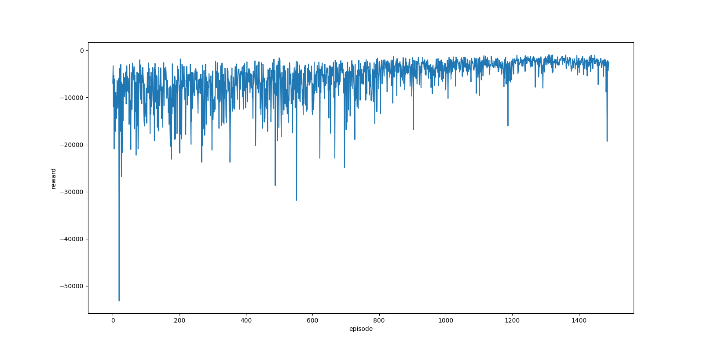
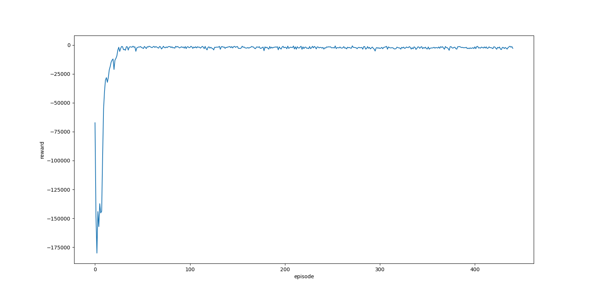
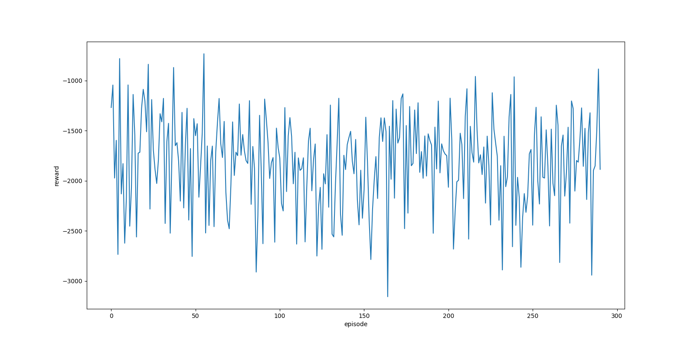

# Traffic signal control with RL

This work based on [**Reinforcement learning-based multi-agent
system for network traffic signal control**](http://citeseerx.ist.psu.edu/viewdoc/download?doi=10.1.1.232.9789&rep=rep1&type=pdf)

## Training Code
### Environment prepare
this code verified on python=3.6 and cuda=10.2 setting.  

```bash
conda env create -f environment.yml
```
or
```bash
pip install -r requirements.txt
```

### Run
```bash
python main.py <optins>
```
#### options
| options                  | default | type    | help                                                                         |
|--------------------------|:-------:|:-------:|------------------------------------------------------------------------------|
| `--episode`              | `1500`  | `int`   | number of maximum episode                                                    |
| `--max_step`             | `2000`  | `int`   | number of maximum step in single episode                                     |
| `--batch_size`           | `128`   | `int`   | [for dqn] batch size                                                         |
| `--gpu_num`              | `0`     | `int`   | GPU number to use                                                            |
| `--lr`                   | `0.1`   | `float` | learning rate                                                                |
| `--gamma`                | `0.99`  | `float` | discount factor                                                              |
| `--epsilon`              | `0.05`  | `float` | [for dqn] e-greedy parameter                                                 |
| `--traffic_change_time`  | `20`    | `int`   | the traffic light changes every `n` steps.                                   |
| `--average_arrival_rate` | `0.1`   | `int`   | vehicle generation ratio                                                     |
| `--algo_type`            | `lqf`   | `str`   | The type of algorithm used by the agent.  choice from `dqn`, `a2c` and `lqf` |
| `--render_type`          | `None`  | `str`   | visualize the state of intersection. choice from `print` and `reder`         |
| `--log_save_path`        | `./`    | `str`   | path to save log                                                             |


## Environment Setting
### Five-Intersection Traffic Network


#### centrally connected vehicular traffic network

- outbound intersection: Operate based on local information.
- inbound intersection: RL-based agent controls traffic signaling.

#### vehicles generation

- during each simulation time step, new vehicles are generated, as governed by a 
  **poisson process**, outside each outbound intersection.
  
- They are placed at the end of the queue of their respective destination lanes.
- no vehicles are generated at the central intersection.

#### intersection config

- each intersection have 8 lanes.
- the capacity of each lane is 40.
- the traffic lights change once every 20 time steps.


## RL Setting
### State

- the state is represented by an eight-dimensional feature vector 
  with each element representing the **relative traffic flow** at one of the lanes.

- the state space size of five-intersection environment is 40(# of lanes in intersections * # of intersections)

#### relative traffic flow


### Action


- the maximal number of applicable, compatible and non-conflicting phase combinations is 
  eight for each isolated intersection presented **{(1,5), (1,6), (2,5), (2,6), (3,7), (3,8), (4,7), (4,8)}**.

- the action space size is 8


### Reward


## Result
### environment setting
```bash
env: five intersection
traffic change time: 20
average arrival rate: 0.1
```
#### A2C


#### DQN


### LQF


