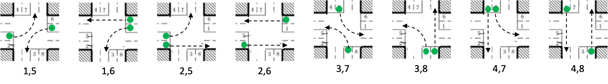

# Traffic signal control with RL

This work based on [**Reinforcement learning-based multi-agent
system for network traffic signal control**](http://citeseerx.ist.psu.edu/viewdoc/download?doi=10.1.1.232.9789&rep=rep1&type=pdf)

## Training Code

## Environment Setting
### Five-Intersection Traffic Network

## RL Setting
### State

### Action

### Reward

## Result

